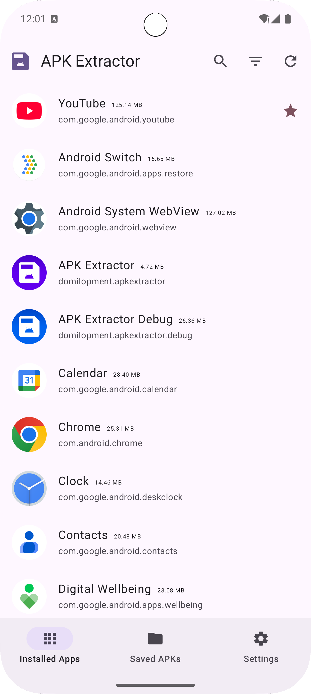
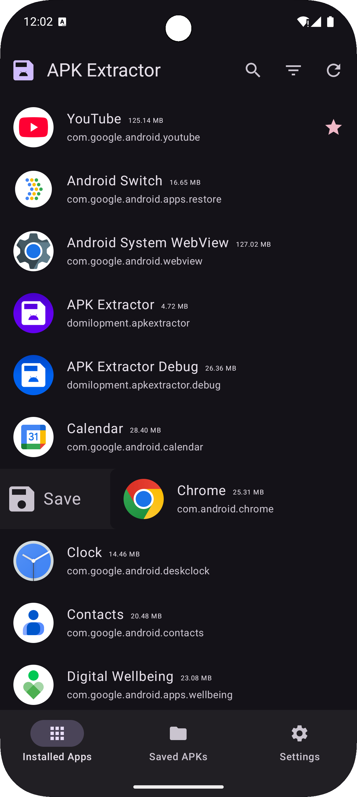
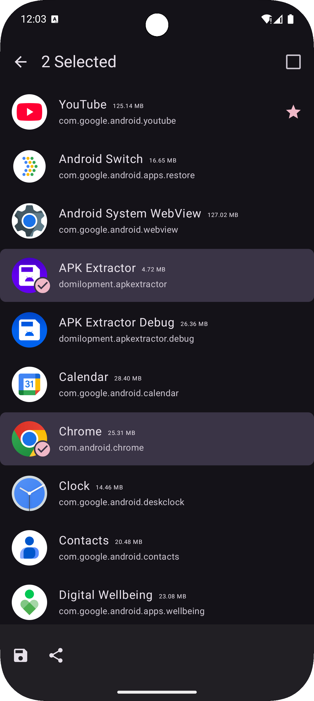
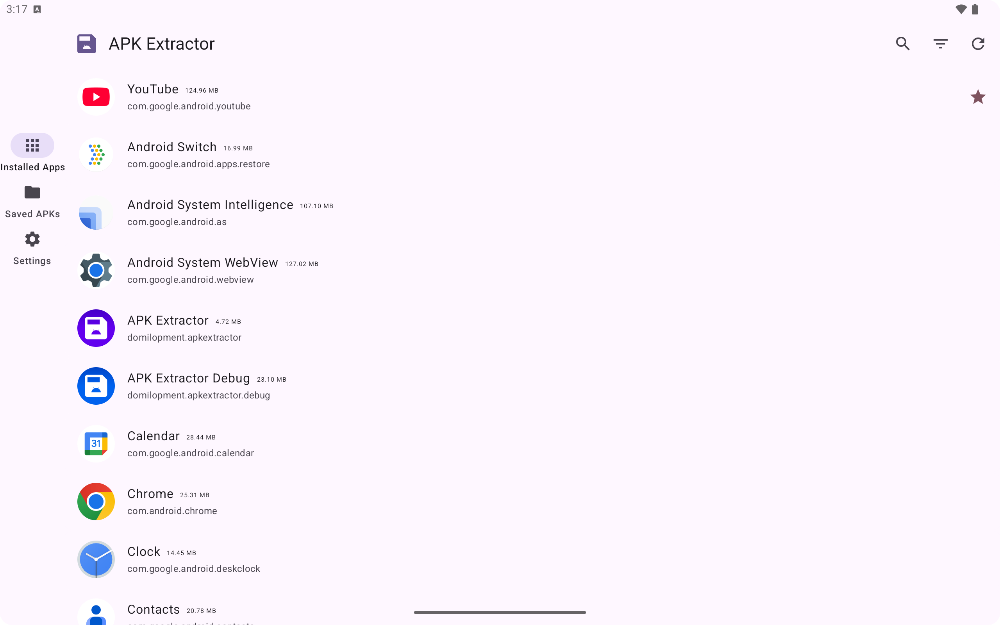
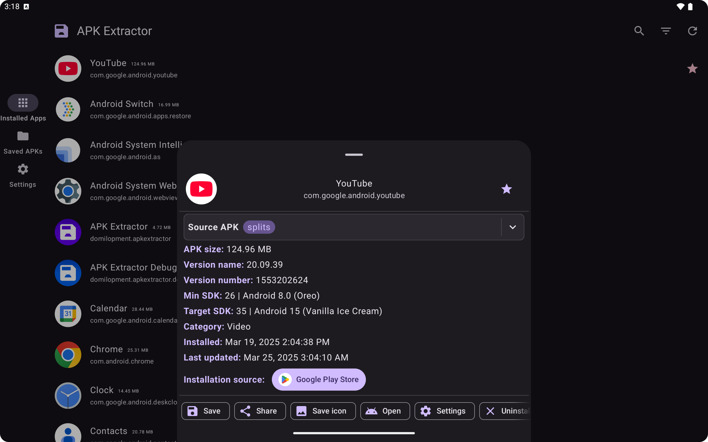
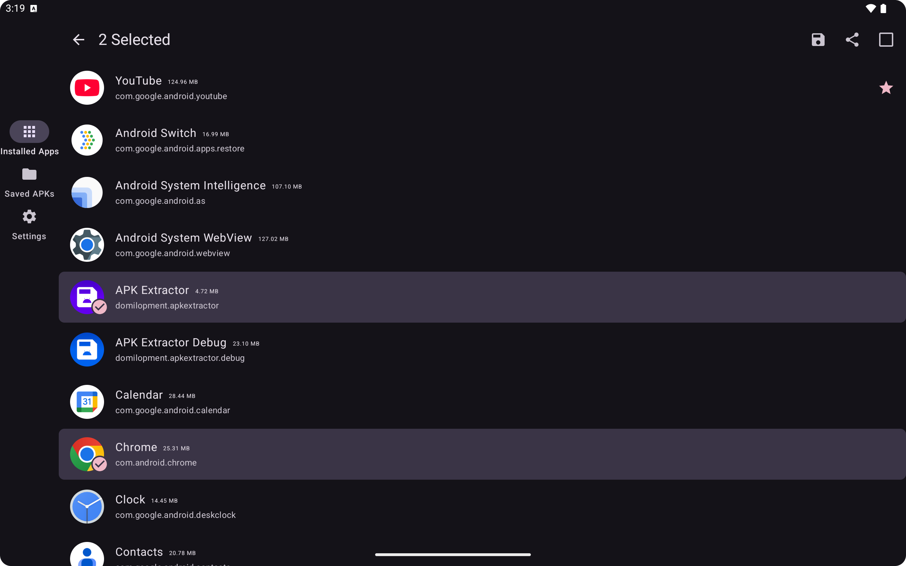
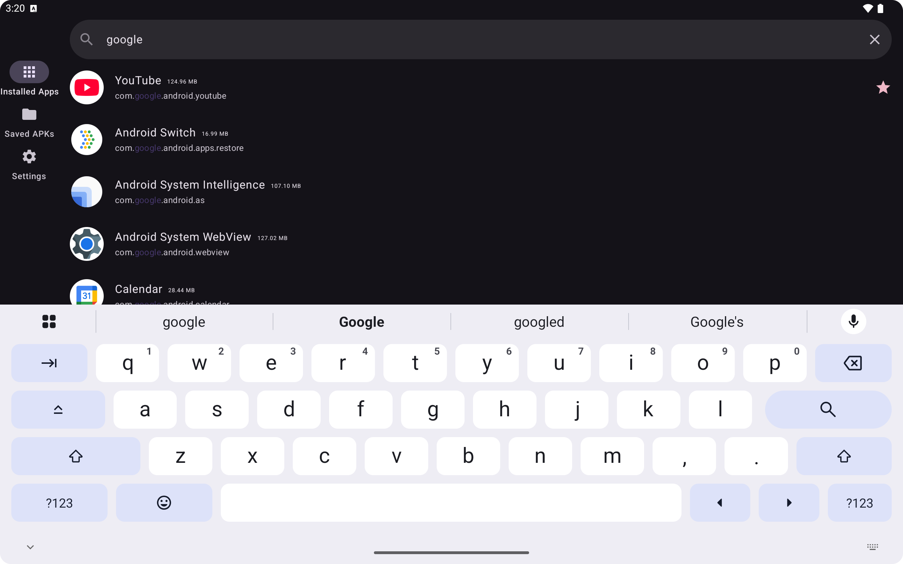
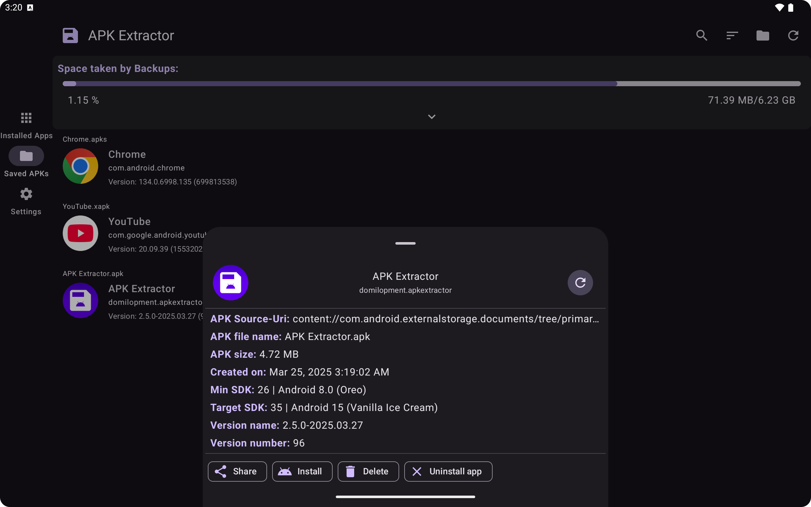
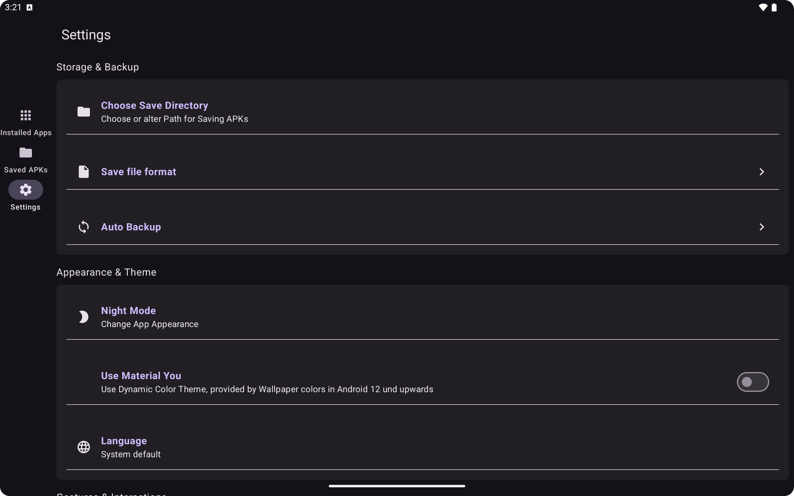

# APK Extractor

A Simple Modern APK Extractor App

The APK Extractor enables you to Backup and Restore your installed App. 
This means to save the install file from the Version on your device to your System and restore it afterwards or Mange them.

## Screenshots

### Smartphone

|                                                |                                                |                                                 |                                                     |
|------------------------------------------------|------------------------------------------------|-------------------------------------------------|-----------------------------------------------------|
|   |    |       |  |
|  |  |  |              |

### Tablet

|                                             |                                                 |
|---------------------------------------------|-------------------------------------------------|
|    |         |
|       |  |
|   |       |
|  |              |

## Highlights

### Provided functions are:

- **Fast and easy to use. (hopefully)**
- **Extracts all application, including system applications. 
  filter apps by user apps, system apps and updated system apps** 
  This means filter the set of installed App with parameters, User Apps (Installed by you), Updated System Apps (Apps, like for example Chrome, that are pre-installed and receive updates from Play Store), or System Apps (every other App on your device, that does not fall under the first two conditions)
- **no ROOT access required**
- **Search applications by app name, package, install- or update time** 
  Sort your Apps to faster find what you are searching for
- **Choose Default Apk's save place** 
  Choose the folder on your System all Apps should be saved to
- **Share Apk's with other services** 
  Share Installed or Saved APKs, to Save backups in a Cloud service or to restore them on other devices
- **small size apk**
- **Include information of package, version-code etc. in Apk name** 
  Include various Information in the name of Saved APKs to faster find the right backup
- **Extract multiple apk in single click** 
  Select multiple Apps with long press the App list items to create backups for all of them at once
- **Backup Installed apps as Single APK or APK-Bundle** 
  Change in Settings if you don't only want to backup base.apk but base.apk + split apks as Bundle file. And decide if the Bundle should have a file suffix of '.apks' or '.xapk' (Only to install an App backup from base.apk file may lead to a crash on launch caused by missing ressources contained in split apks)
- **Follows System Night Mode (can be activated manually in App)** 
  Choose App theme, Light, Dark or follow System, also supports Material You coloring
- **Auto Backup APKs on App updates** 
  Make the App watch for App Updates to Automatic create a backup of the new Version
- **Manage your Backups** 
  View All your backups inside the App, view detailed information about them, like version name/number, creation date, apk size. Select and Share, Delete or Install them (restore backups directly from inside the app).
- **Install APKS/XAPK files from file explorer** 
  Show an installation Dialog if you click on an apks/xapk file in your file explorer to install it (May depend on file explorer).

Programmed with Love^^ ❤

## Contributing

Contributions are welcome! Whether you're fixing bugs, improving documentation, or adding new features or languages, your help is appreciated.

### 🈳 Adding a New Language

To add support for a new language, please follow these steps:

1. **Translate strings**

   * Copy and translate the [`strings.xml`](app/src/main/res/values/strings.xml) file into your target language.
   * Save the translated file in a new directory using the appropriate locale code (e.g. `values-es/` for Spanish, `values-fr/` for French).

2. **Register the language**

   * Add an entry for the new language, including the locale and tag, in [`Languages.kt`](app/src/main/java/domilopment/apkextractor/utils/settings/Languages.kt).

3. **Update locale filters**

   * Add your language to the locale filter list in the build script at [`build.gradle.kts`](app/build.gradle.kts#L37).

4. **Submit a pull request**

   * Open a pull request with your changes.
   * Include a brief description and request a review from the maintainers.

### ✅ Tips

* Make sure your locale code follows Android's [language and region standards](https://developer.android.com/guide/topics/resources/localization).
* Test your language selection in the app to ensure everything displays correctly.
* Keep translations consistent with the original tone and terminology.

Thank you for helping make this project better for everyone!

## License

**APK Extractor** is distributed under the terms of the Apache License (Version 2.0). See the [license](LICENSE) for more information.   
